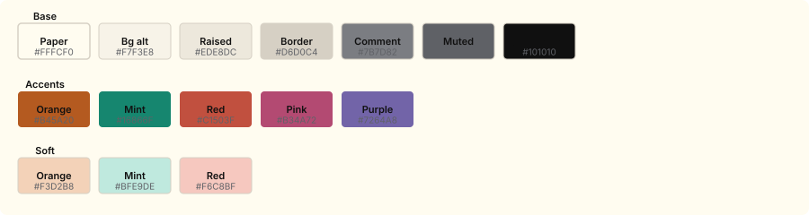

# Lauds

Lauds is a paper-light color theme for prose and code. It is based on the [Vesper Light](https://github.com/samueldsr99/vesper-light) aesthetic, built on the [Flexoki](https://stephango.com/flexoki) paper palette. Lauds features a warm off-white paper background (`#FFFCF0`), charcoal foreground (`#101010`), warm terracotta orange accents (`#B45A20`), and deep mint strings (`#16866F`). This is a **light-only** theme.

Lauds ships as a **VS Code extension**, a **Neovim colorscheme**, and a **pywal** variant.

## Preview



## Colors

### Base

| Color      | Hex       | RGB             | Swatch |
| ---------- | --------- | --------------- | ------ |
| Paper      | `#FFFCF0` | `255, 252, 240` | ██     |
| Bg alt     | `#F7F3E8` | `247, 243, 232` | ██     |
| Raised     | `#EDE8DC` | `237, 232, 220` | ██     |
| Border     | `#D6D0C4` | `214, 208, 196` | ██     |
| Muted      | `#5F6166` | `95, 97, 102`   | ██     |
| Comment    | `#6E7075` | `110, 112, 117` | ██     |
| Foreground | `#101010` | `16, 16, 16`    | ██     |

### Accents

| Color  | Hex       | RGB             | Swatch |
| ------ | --------- | --------------- | ------ |
| Orange | `#B45A20` | `180, 90, 32`   | ██     |
| Mint   | `#147A65` | `20, 122, 101`  | ██     |
| Red    | `#C1503F` | `193, 80, 63`   | ██     |
| Pink   | `#B34A72` | `179, 74, 114`  | ██     |
| Purple | `#7264A8` | `114, 100, 168` | ██     |

### Soft variants

| Color       | Hex       | RGB             | Swatch |
| ----------- | --------- | --------------- | ------ |
| Orange soft | `#F3D2B8` | `243, 210, 184` | ██     |
| Mint soft   | `#BFE9DE` | `191, 233, 222` | ██     |
| Red soft    | `#F6C8BF` | `246, 200, 191` | ██     |

## Syntax highlighting

| Token            | Color     | Style     |
| ---------------- | --------- | --------- |
| Comment          | `#6E7075` | italic    |
| Keyword/Operator | `#5F6166` | —         |
| String           | `#147A65` | —         |
| Number/Boolean   | `#B45A20` | —         |
| Function/Method  | `#B45A20` | —         |
| Type/Class       | `#B45A20` | —         |
| Variable         | `#101010` | —         |
| Property         | `#101010` | —         |
| Error/Invalid    | `#C1503F` | —         |
| Markup heading   | `#B45A20` | bold      |
| Markup link      | `#B45A20` | underline |
| Diff inserted    | `#147A65` | —         |
| Diff deleted     | `#C1503F` | —         |

## Project structure

```
.
├── colors/lauds.lua              # Neovim colorscheme loader
├── lua/lauds/
│   ├── init.lua                  # Plugin entry: setup(), colorscheme(), lualine()
│   ├── palette.lua               # Color palette definitions
│   └── theme.lua                 # Highlight groups + plugin integrations
├── themes/
│   └── lauds-light-color-theme.json  # VS Code theme (TextMate + semantic tokens)
├── variants/pywal/lauds.json     # pywal colorscheme variant
├── scripts/validate.js           # CI validation suite
├── docs/superpowers/             # Design plans & specs
├── package.json                  # VS Code extension manifest
└── .vscodeignore                 # VSIX packaging ignore rules
```

## VS Code

Install the extension locally or package it with `vsce`, then select **Lauds** from the color theme picker.

The VS Code theme includes:

- **85+ workbench colors**: editor, sidebar, activity bar, title bar, tabs, status bar, panels, list, buttons, inputs, scrollbar, terminal ANSI colors, bracket matching, inlay hints, diff editor
- **30+ TextMate token scopes**: comments, keywords, strings, numbers, functions, classes, variables, CSS properties, JSON keys, Markdown (headings, bold/italic, links, raw blocks, tables), regex, diff markers
- **Semantic token colors**: function, method, string, number, comment, keyword, variable, property, type

## Neovim

With a plugin manager, point to this repository and load:

```lua
require("lauds").setup({
  transparent = false,       -- Use terminal background
  italics = {
    comments = true,         -- Italic comments
    keywords = false,        -- Italic keywords
    functions = false,       -- Italic functions
    strings = false,         -- Italic strings
    variables = false,       -- Italic variables
  },
  overrides = {},            -- Override highlight groups
  palette_overrides = {},    -- Override palette colors
})

vim.cmd.colorscheme("lauds")
```

The colorscheme can also be loaded directly:

```vim
colorscheme lauds
```

### Neovim highlight groups

**Core editor groups** (70+ groups): `Normal`, `Cursor`, `LineNr`, `CursorLine`, `Search`, `Visual`, `Pmenu`, `TabLine`, `StatusLine`, `WinSeparator`, `SpellBad/Cap/Local/Rare`, `Folded`, `MatchParen`, etc.

**Syntax groups**: `Comment`, `String`, `Number`, `Function`, `Keyword`, `Type`, `Operator`, `Identifier`, `PreProc`, `Special`, `Todo`, `Error`, `Underlined`, etc.

**Treesitter (nvim-treesitter)**: Full `@...` highlight group coverage:

- Variables (`@variable`, `@variable.builtin`, `@variable.parameter`, `@variable.member`)
- Constants, strings, numbers, booleans, floats
- Functions, methods, constructors, macros
- Keywords, conditionals, repeats, operators
- Types, properties, fields
- Punctuation (delimiters, brackets, special)
- Comments and documentation comments
- Tags, tag attributes
- Markup (headings, bold, italic, links, raw)
- Diff (`@diff.plus`, `@diff.minus`, `@diff.delta`)
- Error, modules, labels

**Diagnostics (vim.diagnostics)**: `DiagnosticError`, `DiagnosticWarn`, `DiagnosticInfo`, `DiagnosticHint`, `DiagnosticOk`, `DiagnosticVirtualText*`, `DiagnosticUnderline*`, `LspReferenceText/Read/Write`

### Plugin integrations

The Neovim theme includes highlight groups for these plugins:

| Plugin          | Highlight groups                                                                                                                                        |
| --------------- | ------------------------------------------------------------------------------------------------------------------------------------------------------- |
| Telescope       | `TelescopeNormal`, `TelescopeBorder`, `TelescopePrompt*`, `TelescopePreviewTitle`, `TelescopeResultsTitle`, `TelescopeSelection`, `TelescopeMatching`   |
| NvimTree        | `NvimTreeNormal`, `NvimTreeFolderName`, `NvimTreeOpenedFolderName`, `NvimTreeRootFolder`, `NvimTreeGitDirty/New/Deleted`                                |
| NeoTree         | `NeoTreeNormal`, `NeoTreeDirectoryName`, `NeoTreeGitAdded/Modified/Deleted`                                                                             |
| nvim-cmp        | `CmpItemAbbr`, `CmpItemAbbrDeprecated`, `CmpItemAbbrMatch`, `CmpItemKind`, `CmpItemMenu`                                                                |
| which-key.nvim  | `WhichKey`, `WhichKeyGroup`, `WhichKeyDesc`, `WhichKeySeparator`, `WhichKeyValue`                                                                       |
| lazy.nvim       | `LazyNormal`, `LazyButton`, `LazyButtonActive`, `LazyH1`, `LazyH2`                                                                                      |
| bufferline.nvim | `BufferLineFill`, `BufferLineBackground`, `BufferLineBufferSelected`, `BufferLineIndicatorSelected`, `BufferLineModified`, `BufferLineModifiedSelected` |
| gitsigns.nvim   | `GitSignsAdd`, `GitSignsChange`, `GitSignsDelete`                                                                                                       |

### lualine.nvim

The colorscheme provides a built-in **lualine theme**:

```lua
require("lualine").setup({
  options = { theme = require("lauds").lualine() },
})
```

Mode indicators: **normal** (orange), **insert** (mint), **visual** (muted), **replace** (red), **command** (orange).

## pywal

A [pywal](https://github.com/dylanaraps/pywal) colorscheme variant is available at `variants/pywal/lauds.json`. Copy it to `~/.config/wal/colorschemes/light/` to use it with `wal --theme lauds`.

## Validation

```bash
npm test
```

The validation script (`scripts/validate.js`) verifies:

1. **Package manifest** — correct name, display name, theme contribution
2. **VS Code theme** — all required colors and token scopes present
3. **Neovim source files** — palette keys (`bg`, `fg`, `orange`, `mint`, etc.), module exports (`setup`, `colorscheme`), Treesitter/diagnostic ligatures
4. **Palette usage** — all key colors (`#FFFCF0`, `#101010`, `#B45A20`, `#16866F`, `#C1503F`) appear in the VS Code theme
5. **pywal scheme** — correct references, hex color validity, key color values
6. **Neovim runtime** — headless Neovim loads and applies the colorscheme without errors

## License

MIT — see [LICENSE](./LICENSE).
